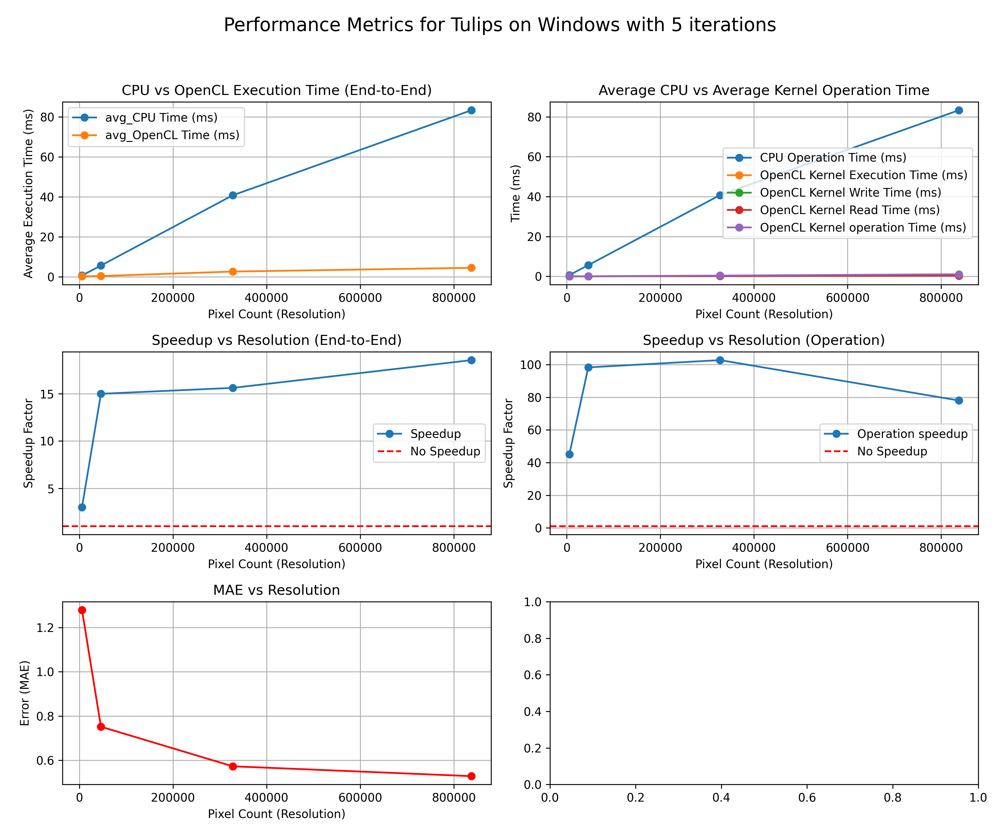
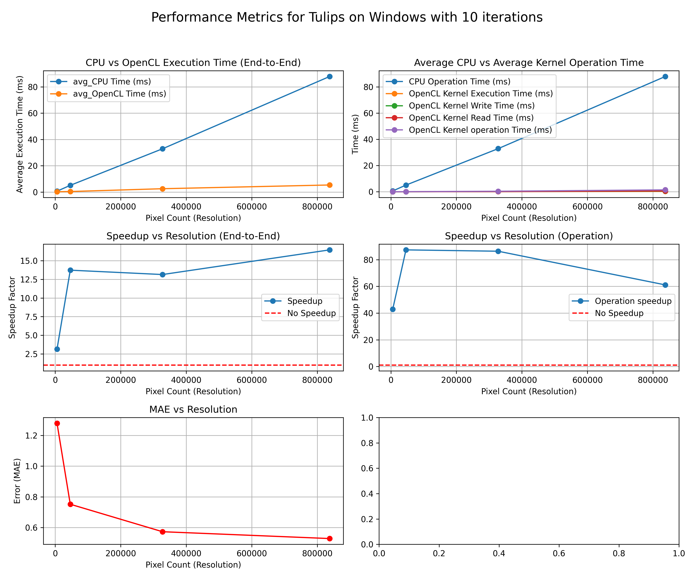
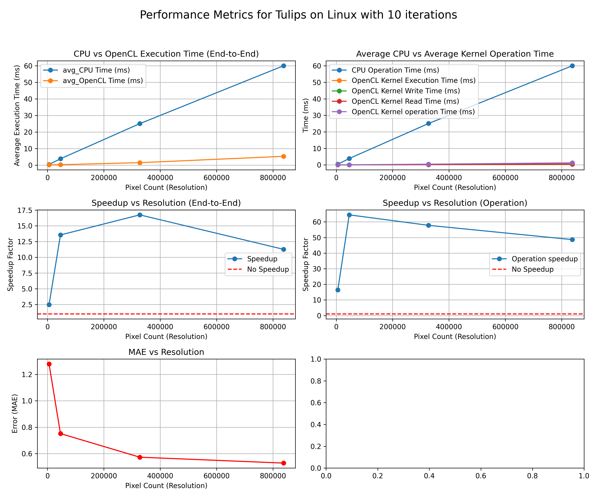
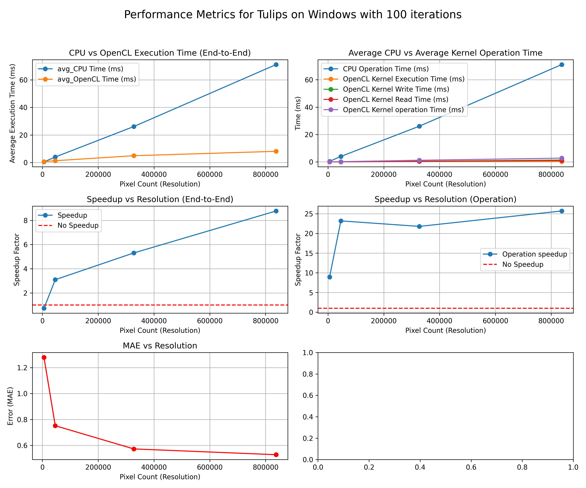
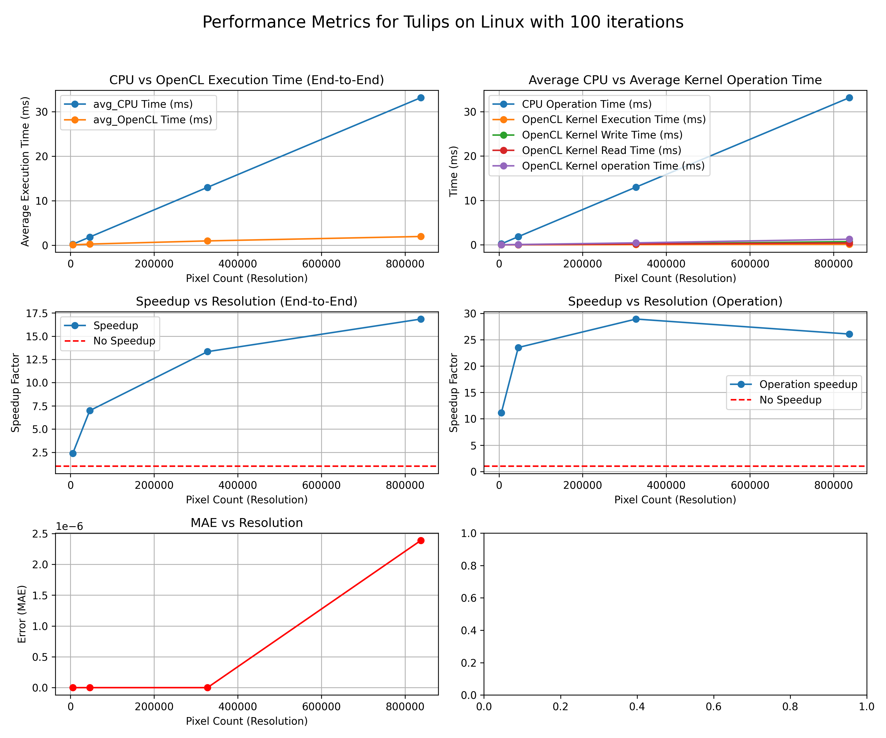

# Gaussian Blur
This document showcases the research and planning of the **Gaussian Blur** image processing method.

## Principle
**Source**: [Blur clarrified](https://jov.arvojournals.org/article.aspx?articleid=2191790)

In the narrower technical context of vision, optics, and imaging, blurring generally connotes a smearing of an image, through some amount of low-pass filtering. Gaussian blur is defined as convolution with a Gaussian impulse response.

Process of blurring an image by convolving it with a Gauss function is called Gaussian Blurring. It is a method to reduce image noise and details on graphic applications. It involves computing a **weighted average** of neighbouring pixels.[source](https://www.ijml.org/vol5/483-W012.pdf)

## Methodology
Applying a Gaussian blur to images involves the convolution of an image with a Gaussian function. The convolution calculates the transformation to apply to each pixel in the image.

Gaussian function in `1D`:
```math
G(x) = \frac{1}{\sqrt{2\pi\sigma^2}} e^{-\frac{x^2}{2\sigma^2}}
```

Gaussian function in `2D`:
```math
G(x,y) = \frac{1}{2\pi\sigma^2} e^{-\frac{x^2+y^2}{2\sigma^2}}
```

**Properties**:
- **x**: Distance from origin in the horizontal axis ((0,0) at centre)
- **y**: Distance from origin in the vertical axis((0,0) at centre)
- **$\sigma$**: Standard deviation of the Gaussian distribution (controls the blur strength)

The values from this function is used to build a convolution matrix which is applied to the original image. Each pixel's new value is set to the **weighted average** of the pixel's neighbourhood (dimension of kernels). The size of the kernel is typically odd (3x3, 5x5, 9x9, .etc).

## OpenCL Kernel

### Purpose
Perfom Gaussian blur effect on images by applying convovlution with gaussian function.

### Parameters
1. **`image2d_t` inputImage**: Converted `2D` image data to `std::vector<unsigned char>`
2. **`image2d_t` outputImage**: Output `std::vector<unsigned char>` with dimension `width * height`
3. **`float` gaussian_kernel**: Gaussian kernel for `blur` effect
4. **`int` kernel_size**: Size of the gaussian kernel
3. **`int` width**: Height of the input image
4. **`int` height**: Width of the input image

#### Kernel: Initialisation
```c++
// Get the position of the current thread
const int x = get_global_id(0);
const int y = get_global_id(1);
```
**Global thread assignment**: Each work item is processes one pixel, identified by `(x,y)`, the global thread IDs.

#### Kernel: Boundary Check
```c++
if (x >= width || y >= height) {
    return;
}
```
**Boundary Check**: Check if the threads are within the dimensions of the image.

#### Kernel: Kernel Iteration
```c++
// Iterate over the kernel
for (int ky = -kernel_size / 2; ky <= kernel_size / 2; ky++) {
    for (int kx = -kernel_size / 2; kx <= kernel_size / 2; kx++) {
        // Weighted average stuff here...
    }
}
```
**Kernel Function Iteration**: Iterate through the kernel function from top-left to bottom right.

#### Kernel: Weighted Average
```c++
// Get the pixel value and weight
int2 coord = (int2)(x + kx, y + ky);
float weight = gaussian_kernel[(ky + kernel_size / 2) * kernel_size + (kx + kernel_size / 2)];
float4 pixel = read_imagef(input_image, sampler, coord);

sum += weight * pixel;
```
**Gaussian Weighted average**: Calculate the weigjted average of each pixel and its neighbouring pixels.

#### Kernel: Output
```c++
// Write the blurred pixel to the output
write_imagef(output_image, (int2)(x, y), sum);
```
**Output Image to Host**: Write the `output_image` back to the host.

#### Kernel: Complete Implementation
```c++
constant sampler_t sampler = CLK_NORMALIZED_COORDS_FALSE | CLK_ADDRESS_CLAMP | CLK_FILTER_NEAREST;

__kernel void gaussian_blur(__read_only image2d_t input_image,
                            __write_only image2d_t output_image,
                            __constant float *gaussian_kernel,
                            const int kernel_size,
                            int width,
                            int height) {
    
    // Get the position of the current thread
    const int x = get_global_id(0);
    const int y = get_global_id(1);

    if (x >= width || y >= height) {
        return;
    }
    
    // Initialize the sum of the pixel values
    float4 sum = (float4)(0.0f, 0.0f, 0.0f, 0.0f);

    // Iterate over the kernel
    for (int ky = -kernel_size / 2; ky <= kernel_size / 2; ky++) {
        for (int kx = -kernel_size / 2; kx <= kernel_size / 2; kx++) {
            
            // Get the pixel value and weight
            int2 coord = (int2)(x + kx, y + ky);
            float weight = gaussian_kernel[(ky + kernel_size / 2) * kernel_size + (kx + kernel_size / 2)];
            float4 pixel = read_imagef(input_image, sampler, coord);

            sum += weight * pixel;
        }
    }

    // Write the blurred pixel to the output
    write_imagef(output_image, (int2)(x, y), sum);
}
```

### Operation

## Performance Analysis
This section provides an overview of the testing procedure and the factors considered in the analysis.

### Test Outline
1. Load the `Tulips` images from the `images` directory
2. Perform the Sobel edge-detection on the `CPU` and `OpenCL` with `5,` `10`, and `100` iterations
3. Record the following factors:
    - Average end-to-end execution time
    - Average Kernel operations timings (reading, executing, and writing)
    - Output comparison results with MAE
4. Save results into a `.csv` file
5. Peform on Linux and Windows

### 5 Iterations
| Windows  | Linux |
| :-------------: | :-------------: |
|   |   |

### 10 Iterations
| Windows  | Linux |
| :-------------: | :-------------: |
|   |   |

### 100 Iterations
| Windows  | Linux |
| :-------------: | :-------------: |
|   |   |

## Summary: (Linux-Only)
### Execution Time (End-to-End)
`OpenCL` consistently outperforms the `CPU` as resolution increases.

#### Examples
1. With resolution of `1023x819` performed with `5` iterations
    - **CPU**: 59.8292ms
    - **OpenCL**: 4.57505ms
    - **Speedup**: ```math 59/4``` ≈ 14.75x

2. With resolution of `1023x819` performed with `100` iterations
    - **CPU**: 54.2896ms
    - **OpenCL**: 2.5967ms
    - **Speedup**: ```math 54/2``` ≈ 27x

### Kernel Operation
1. `OpenCL` kernel execution often below `2ms`
2. Overhead from `OpenCL` memory operations is minimal compared to the total CPU operation time.

### Accuracy
1. As resolution increases, the `MAE` values follow a trend of `MAE < 1.0`
2. Demonstrating high accuracy for `OpenCL` implementation

### Performance Gain
For both end-to-end and kernel operations a `positive` speedup trend exists.

#### Examples
1. With resolution of `1023x819` performed with `5` iterations
    - **End-to-End Speedup**: ```math 59/4``` ≈ 14.75x
    - **Kernel Speedup**: ```math 59/2``` ≈ 29.5x

2. With resolution of `1023x819` performed with `100` iterations
    - **End-to-End Speedup**: ```math 54/2``` ≈ 27x
    - **Kernel Speedup**: ```math 54/2``` ≈ 27x

### Portability
`OpenCL` demonstrates consistent scalibility across iterations and resolutions
