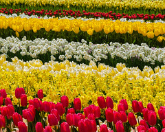
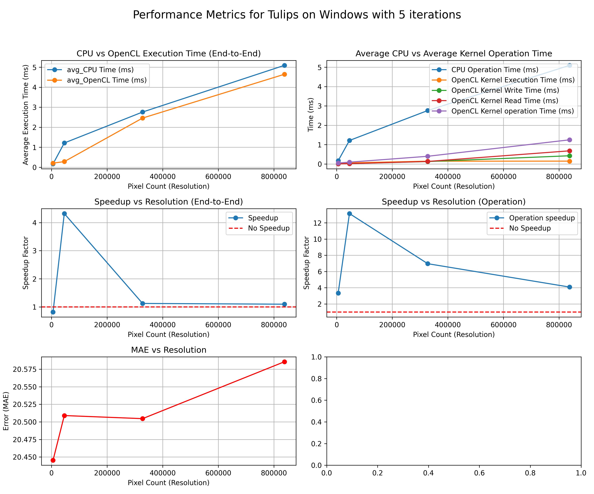
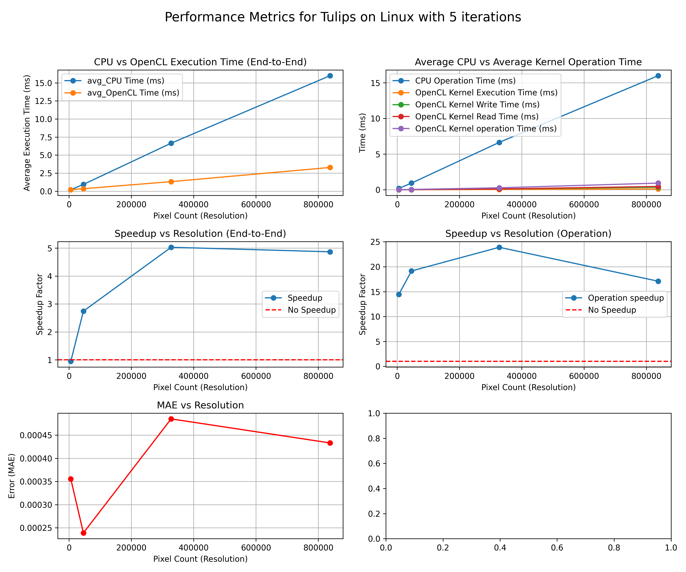
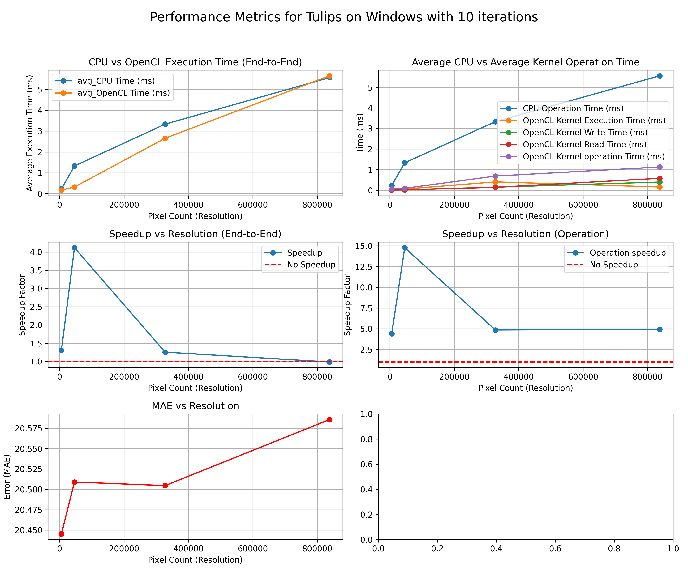
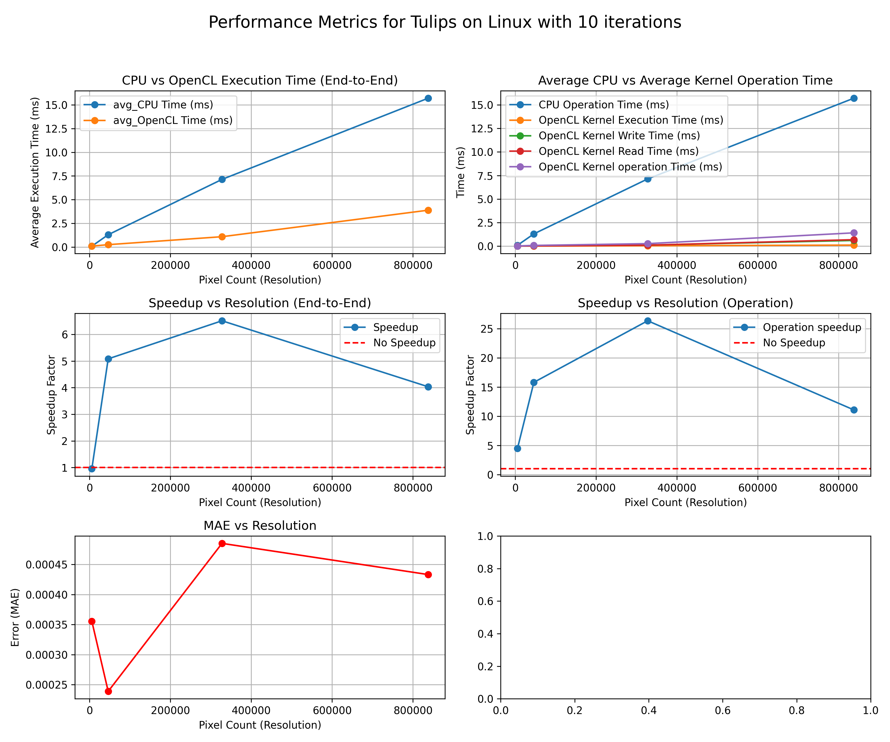
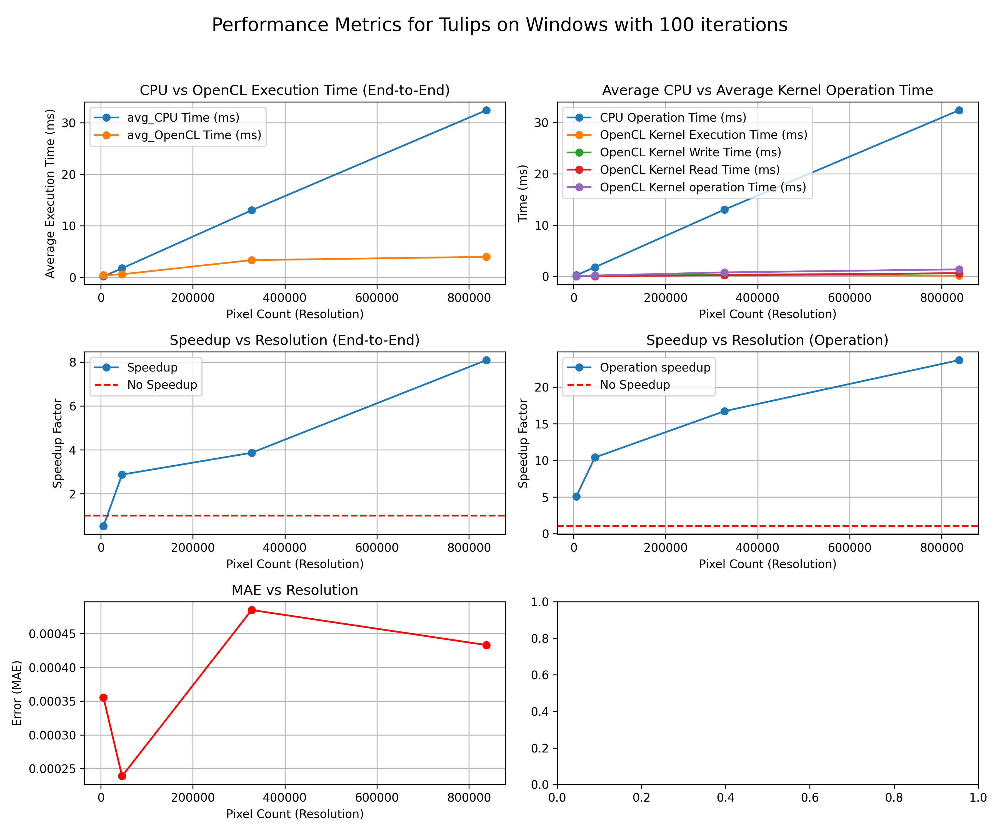
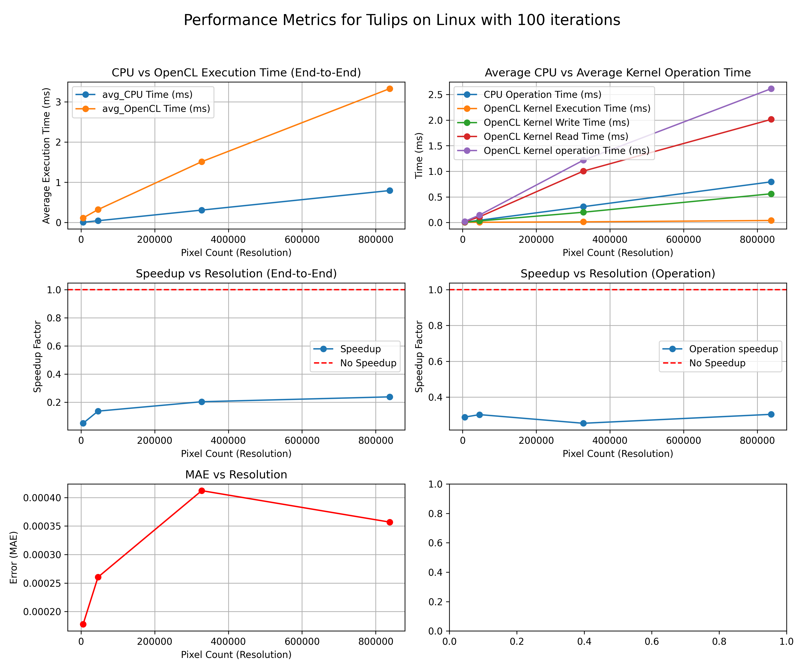

# Grayscale
**Source**: [Color Image to Grayscale Image Conversion](https://ieeexplore.ieee.org/abstract/document/5445596?signout=success)

Conversion of color image to grayscale image is one of the image processing applications used in different fields effectively.

In publication organizations' printing, a color image is expensive compared to a grayscale image. Thus, color images have converted to grayscale image to reduce the printing cost for low priced edition books. Similarly, color deficient viewer requires good quality of grayscale image to perceive the information, as the normal people perceive the color picture.

Conversion of a color image to a grayscale image requires more knowledge about the color image. A pixel color in an image is a combination of three colors Red, Green, and Blue (RGB). The RGB color values are represented in three dimensions XYZ, illustrated by the attributes of lightness, chroma, and hue. Quality of a color image depends on the color represented by the number of bits the digital device could support. The basic color image represented by 8 bit, the high color image represented using 16 bits, the true color image represented by 24 bit, and the deep color image is represented by 32 bit. The number of bits decides the maximum number of different colors supported by the digital device. If each Red, Green, and Blue occupies 8 bit then the combination of RGB occupies 24 bit and supports 16,777,216 different colors. The 24 bit represents the color of a pixel in the color image. The grayscale image has represented by luminance using 8 bits value. The luminance of a pixel value of a grayscale image ranges from 0 to 255. 

The conversion of a color image into a grayscale image is converting the RGB values (24 bit) into grayscale value (8 bit).

## Algorithm: Luminance Formula
```shell
Y = (0.299R) + (0.587G) + (0.114B)
```

These weights correspond to the human eye's sensitivity to each color channel (green is most prominent, then red, and finally blue).

1. R = Red value of source pixel
2. G = Green value of source pixel
3. B = Blue value of source pixel
4. Y = Gray value of the pixel

## OpenCL Kernel
**Purpose**: Convert a colour image in `uchar4` (RGBA) format into grayscale.

**Parameters**:
1. `input_image`: Global memory buffer that contains the input RGBA image defined in `uchar4`. The `uchar4` structure contains a `x`, `y`, `z`, and `w` element which represents the `R`, `G`, `B`, and `A` elements of an image respectively.
2. `output_image`: Global memory buffer that contains the produced grayscale image
3. `width`: Width of the source image
4. `height`: Height of the source image

### Kernel: Initialisation
Using OpenCL, the global index space is used to divide work among work-items.

```c++
int x = get_global_id(0);   // x coordinate of the pixel
int y = get_global_id(1);   // y coordinate of the pixel
```
### Kernel: Linear index calculation
To simplify the iteration over `2D` pixel coordinates, the coordinates are converted to a `1D` linear index using the following formula.

```c++
// Calculate the linear index
int idx = y * width + x;
```

### Kernel: Grayscale conversion
Performing the grayscale conversion by iterating over the `1D` pixel indexes.

#### 1-D Array
```c++
// Ensure within bounds
if(x < width && y < height){
    // Read RGBA pixel
    uchar4 pixel = input_image[idx];

    // Compute grayscale value using luminance formula
    uchar gray = (uchar)(0.299f * pixel.x + 0.578f * pixel.y + 0.114f * pixel.z);
    output_image[idx] = gray;
}
```

To improve the memory management to and from the kernel (device), the `2DImage` structure is used. `2DImage` object is `OpenCL`'s optimised method of handling images in 2D or 3D.

#### OpenCL 2DImage
```c++
__constant sampler_t sampler = CLK_NORMALIZED_COORDS_FALSE | CLK_ADDRESS_CLAMP | CLK_FILTER_NEAREST;

__kernel void grayscale(
    __read_only image2d_t inputImage,
    __write_only image2d_t outputImage,
    const int width,
    const int height)
{
    int x = get_global_id(0); // X-coordinate
    int y = get_global_id(1); // Y-coordinate

    if (x < get_image_width(inputImage) && y < get_image_height(inputImage)) {
        int2 coord = (int2)(x, y);

        float4 pixel = read_imagef(inputImage, sampler, (int2) (x,y));
        
        // Grayscale calculation
        float gray = 0.299f * pixel.x + 0.587f * pixel.y + 0.114f * pixel.z;

        // Write the grayscale value to the output image
        write_imagef(outputImage, (int2)(x, y), (float4)(gray, 0.0f, 0.0f, 1.0f));
    }
}
```

## Performance Analysis
This section provides an overview of the testing procedure and the factors considered in the analysis.

### Test Outline
1. Load the `Artemis` or `Tulips` images from the `images` directory
2. Perform the grayscale conversion on the `CPU` and `OpenCL` with `5,` `10`, and `100` iterations
3. Record the following factors:
    - Average end-to-end execution time
    - Average Kernel operations timings (reading, executing, and writing)
    - Output comparison results with MAE
4. Save results into a `.csv` file
5. Peform on Linux and Windows




### 5 Iterations




### 10 Iterations



### 100 Iterations



## Summary
#### Execution Time (End-to-End)
1. `OpenCL` maintains a near-linear execution time as `pixel-count` increases
2. Performance gain remains consistent across iterations

#### Kernel Operation Time
1. `OpenCL` kernel `execution` dominates its `operation` time.
2. At largest testing resolution (`1023x819`), the kernel `execution` time remains under `~2ms`
3. `Write` times (Host -> Device) at range of: `~0.3ms - 0.004ms`
4. `Read` times (Device -> Host) at range of: `~0.7ms - 0.003ms`

#### Speedup Factor
1. `OpenCL` provides significant speedup compared to `CPU`, particularly at high resolutions
2. At largest testing resolution, the speedup factor is: `~7ms`
3. Kernel operations experience higher speedups compared to end-to-end due to memory overheads

#### Accuracy
1. The **Mean Absolute Error (MAE)** decreases as the resolution increases due to reduced quantisation errors

#### Performance Gain
1. `OpenCL` achieves consistent `4x-6x` end-to-end speedup over the `CPU`
2. Kernel operations can reach `~25x` speedup compared to `CPU` equivalent tasks

#### Efficiency
1. `OpenCL` achieves stable execution times as resolution increases
2. Kernel `operations` dominate (slower) OpenCL `execution`, indicating minimal bottlenecks from `read/write` overhead

#### Portability
1. `OpenCL` showcase its ability to work on different OS systems
2. `OpenCL` showcase its independence from hardware platforms

#### Tradeoffs
1. As iterations increase, the `speedup` factor decreases due to memory/execution overheads