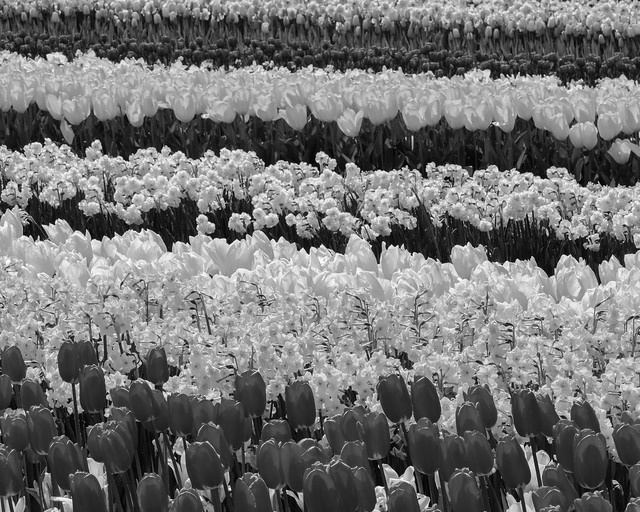
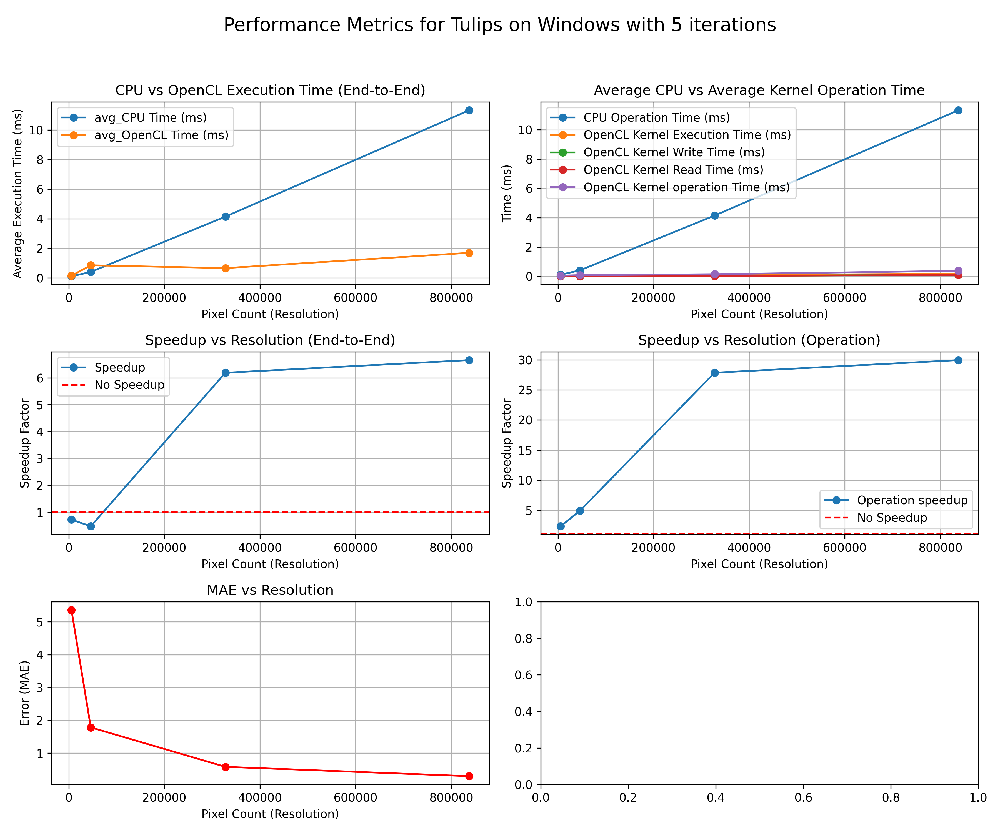
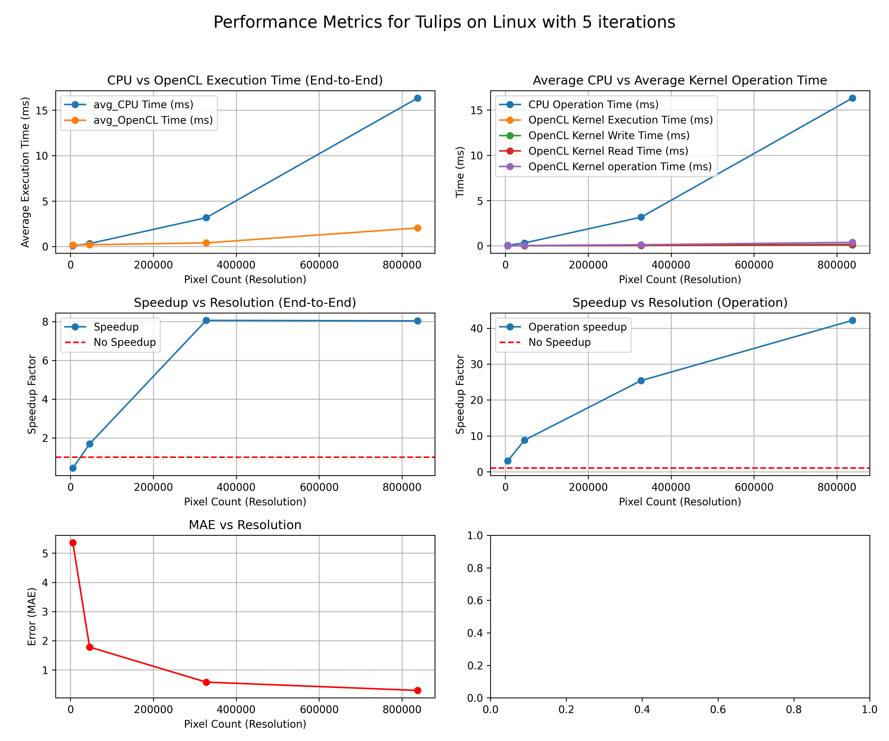
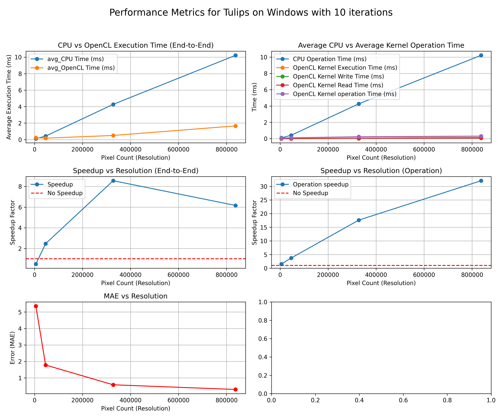
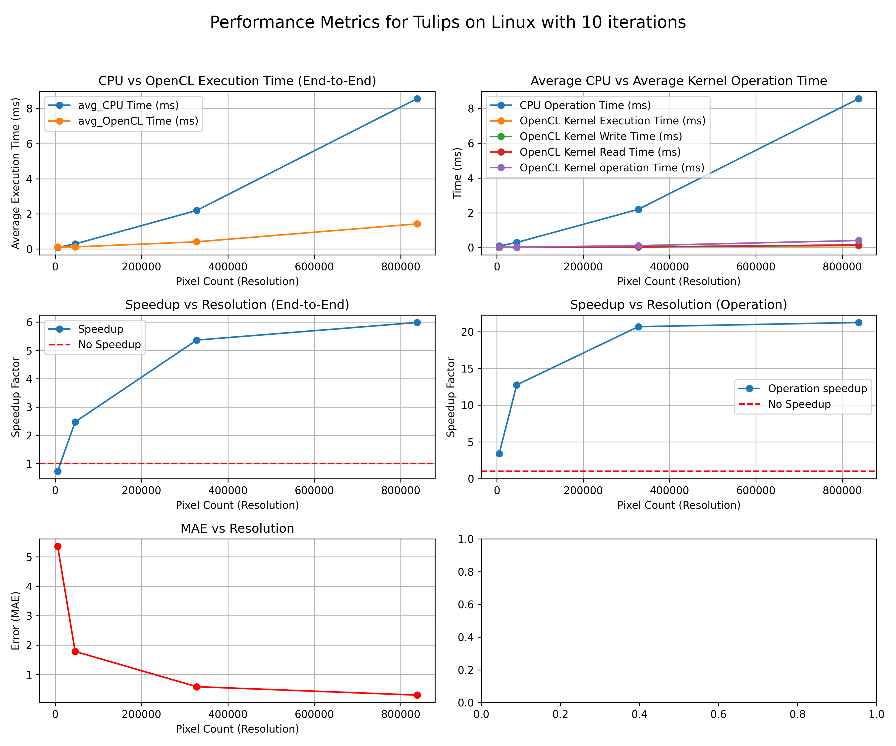
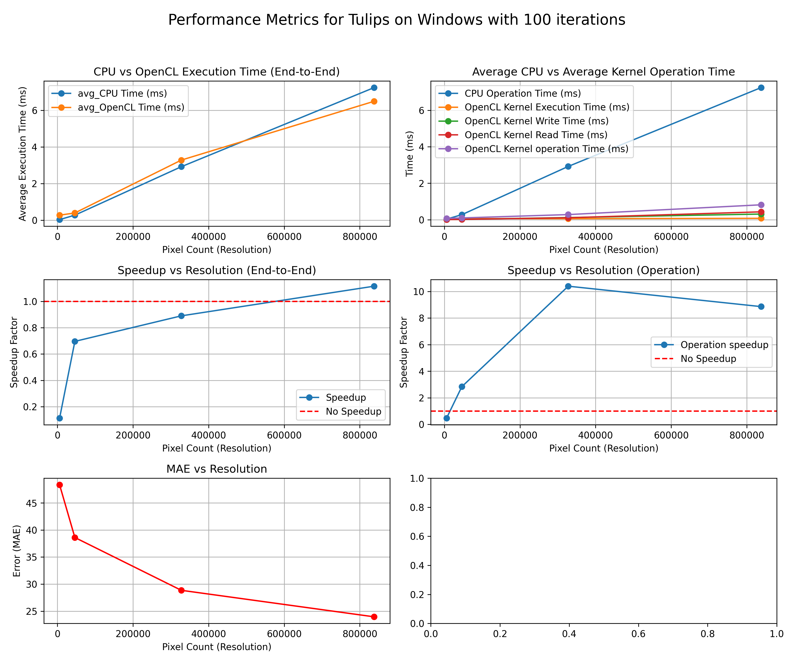
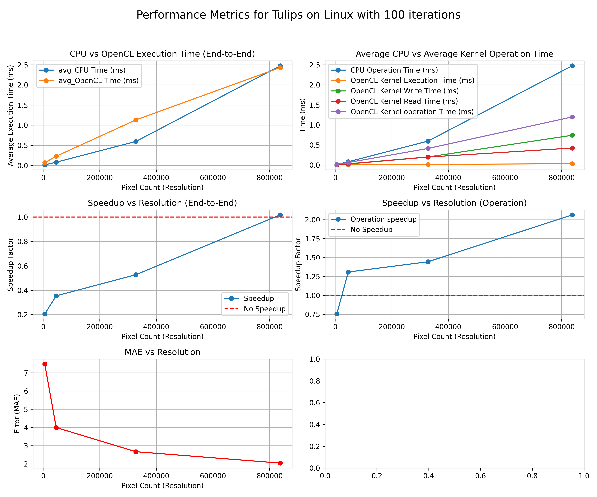

# Sobel Edge Detection
This document showcases the research and planning of the **Sobel Edge-Detection** image processing method.

## Principle
**Source:** [Improved Sobel Edge Detection](https://ieeexplore.ieee.org/abstract/document/5563693)

The edge of an image is the most basic features of the image. It contains a wealth of internal information of the image. In digital image, the so-called edge is a collection of the pixels whose gray value has a step or roof change, and it also refers to the part where the brightness of the image local area changes significantly. The gray profile in this region can generally be seen as a step. That is, in a small buffer area, **a gray value rapidly changes to another whose gray value is largely different** with it.

**Edge detection is mainly the measurement, detection and location of the changes in image gray**. Therefore, the general method of edge detection is to study the changes of a single image pixel in a gray area, use the variation of the edge neighboring first-order or second-order to detect the edge. This method is used to refer as local operator edge detection method.

The **Sobel–Feldman operator** is based on **convolving the image with a small, separable, and integer-valued filter in the horizontal and vertical directions** and is therefore relatively inexpensive in terms of computations. On the other hand, the gradient approximation that it produces is relatively crude, in particular for high-frequency variations in the image. [source](https://en.wikipedia.org/wiki/Sobel_operator)

Compared to other edge operator, Sobel has two main advantages:
1. **Average factor**: Smoothing effect to random noise of the image
2. **Differrential**: Elements of the edge on both sides are enhanced, **produces thick and bright edges**

## Methodology
The operator uses two **3x3** matrix kernels which are convolved with the original image to calculate aproximations of the derivatives; one for horizontal and another for vertical.

### Base Formula
**Variables**:
- **A**: Source image
- **Gx**: Image matrix with each point contains the **horizontal** derivative approximations
- **Gy**: Image matrix with each point contains the **vertical** derivative approximations

**note**: The `*` operator denotes the 2-D convolution operation

```math
G_x = \begin{bmatrix}+1 & 0 & -1\\+2 & 0 & -2\\+1 & 0 & -1\end{bmatrix} * A \\
G_y = \begin{bmatrix}+1 & +2 & +1\\0 & 0 & 0\\-1 & -2 & -1\end{bmatrix} * A
```

### Improved Formula
The sobel matrix kernels can be decomoposed as products of an **averaging** and a **differentiation** kernel, which computes a gradient with smoothing.

```math
G_x = \begin{bmatrix}1\\2\\1\end{bmatrix} * (\begin{bmatrix}1 & 0 & -1\end{bmatrix} * A)\\
G_y = \begin{bmatrix}+1\\0\\-1\end{bmatrix} * (\begin{bmatrix}1 & 0 & -1\end{bmatrix} * A)
```

In implementations, this separable computation can be advantageous since it implies fewer arithmetic operations for each image point (pixel).

**Properties**:
1. `G_x`: Increasing in the "right-direction"
2. `G_y`: Increasing in the "down-direction"

### Supporting Formulas
At each point (pixel) in the image, the **magnitude** of the gradient can be calculated using:
```math
G = \sqrt{G_x^2 + G_y^2}
```

The **direction** of the gradient can be calculated using:
```math
\theta = atan2(G_y, G_x)
```

Therefore, the complete calculation can be described in pseudocode as:
```math
N(x,y) = \sum_{i=-1}^{1}\sum_{j=-1}^{1}K(i,j)P(x-i,y-j)
```

**Where**:
- **N(x, y)**: New pixel matrix
- **K(i, j)**: `Average` and `Differential` matrices
- **P(x-i, y-j)**: Original matrix

## OpenCL Kernel
The following subsections showcases the `sobel_edge.cl` kernel and describes the steps taken to perform Sobel edge-detection.

### Purpose
Take an input image and apply the Sobel operator to compute the intensity gradient at each pixel

### Parameters
1. **`image2d_t` inputImage**: Converted `2D` image data to `std::vector<unsigned char>`
2. **`image2d_t` outputImage**: Output `std::vector<unsigned char>` with dimension `width * height`
3. **`int` width**: Height of the input image
4. **`int` height**: Width of the input image

### Operation
#### Kernel: Initialisation
```c++
int x = get_global_id(0);
int y = get_global_id(1);
```
**Global thread assignment**: Each work item is processes one pixel, identified by `(x,y)`, the global thread IDs.

#### Kernel: Bounds
```c++
if (x >= 1 && x < width - 1 && y >= 1 && y < height - 1)
```
**Boundary Check**: Ensures the pixel is not on the edges of the image

##### Why Start with `x >= 1` and Not Surpass `x < width - 1`?
Sobel operators require `3x3` region of pixels around the current pixel to be processed. For any pixel `(x,y)` this means acessing the following pixels:
- Horizontal (x): x-1(left),  x(Middle),  x+1(Right)
- Vertical (y): y-1(left),  y(Middle),  y+1(Right)

##### Out of bound cases
If `x=0`, the region `x-1` will be out of bounds!

If `x=width - 1`, the region `x+1` will be out of bounds!

Same logic applies to the vertical boundaries.

#### Kernel: Variables
```c++
int2 coord;
float gx = 0.0f;
float gy = 0.0f;

// Sobel operator
const int sobelX[3][3] = {
    {-1, 0, 1},
    {-2, 0, 2},
    {-1, 0, 1}
};

const int sobelY[3][3] = {
    {-1, -2, -1},
    {0,  0,  0},
    {1,  2,  1}
};
```

#### Kernel: Applying Filter
```c++
// Apply Sobel filter
for (int ky = -1; ky <= 1; ky++) {
    for (int kx = -1; kx <= 1; kx++) {
        coord.x = x + kx;
        coord.y = y + ky;

        float pixel = read_imagef(inputImage, sampler, coord).x;

        gx += pixel * sobelX[ky + 1][kx + 1];
        gy += pixel * sobelY[ky + 1][kx + 1];
    }
}
```
Gets the `intensity` of the pixel with `read_imagef(...).x` as the `inputImage` is in `grayscale`. Multiplies pixel intensity with Sobel filter values `sobelX` and `sobelY`. Compute the magnitude and accumulate results onto `g_x` and `g_y` gradients.

###### Visual example:
For an image `5x5` (width x height)
```
   Image Coordinates:
   0  1  2  3  4
0  *  *  *  *  *  <- Cannot process these (no valid neighbors)
1  * [ ] [ ] [ ] *  <- Can process only the inner region (with neighbors)
2  * [ ] [ ] [ ] *  
3  * [ ] [ ] [ ] *  
4  *  *  *  *  *  <- Cannot process these (no valid neighbors)

   [ ] -> Processed pixels
   *   -> Ignored boundary pixels
```

#### Kernel: Calculation and Output
```c++
// Calculate gradient magnitude
float magnitude = sqrt(gx * gx + gy * gy);
magnitude = clamp(magnitude, 0.0f, 1.0f);

// Write to output image
write_imagef(outputImage, (int2)(x, y), (float4)(magnitude, magnitude, magnitude, 1.0f));
```
Calculate the `magnitude` of the pixel and clamp the values to the range `[0,1]` to fit normalised values. Write the gradient magnitude as grayscale value to the output image in `RGBA` format.

#### Kernel: Complete Implementation
```c++
__constant sampler_t sampler = CLK_NORMALIZED_COORDS_FALSE | CLK_ADDRESS_CLAMP_TO_EDGE;

__kernel void sobel_edge_detection(__read_only image2d_t inputImage,
                                   __write_only image2d_t outputImage,
                                   const int width, const int height){
    int x = get_global_id(0);
    int y = get_global_id(1);

    if (x >= 1 && x < width - 1 && y >= 1 && y < height - 1) {
        int2 coord;
        float gx = 0.0f;
        float gy = 0.0f;

        // Sobel Kernels
        const int sobelX[3][3] = {
            {-1, 0, 1},
            {-2, 0, 2},
            {-1, 0, 1}
        };
        
        const int sobelY[3][3] = {
            {-1, -2, -1},
            {0,  0,  0},
            {1,  2,  1}
        };

        // Apply Sobel filter
        for (int ky = -1; ky <= 1; ky++) {
            for (int kx = -1; kx <= 1; kx++) {
                coord.x = x + kx;
                coord.y = y + ky;

                float pixel = read_imagef(inputImage, sampler, coord).x;

                gx += pixel * sobelX[ky + 1][kx + 1];
                gy += pixel * sobelY[ky + 1][kx + 1];
            }
        }

        // Calculate gradient magnitude
        float magnitude = sqrt(gx * gx + gy * gy);
        magnitude = clamp(magnitude, 0.0f, 1.0f);

        // Write to output image
        write_imagef(outputImage, (int2)(x, y), (float4)(magnitude, magnitude, magnitude, 1.0f));
    }
}
```

## Performance Analysis
This section provides an overview of the testing procedure and the factors considered in the analysis.

### Test Outline
1. Load the `Tulips` images from the `images` directory
2. Perform the Sobel edge-detection on the `CPU` and `OpenCL` with `5,` `10`, and `100` iterations
3. Record the following factors:
    - Average end-to-end execution time
    - Average Kernel operations timings (reading, executing, and writing)
    - Output comparison results with MAE
4. Save results into a `.csv` file
5. Peform on Linux and Windows

<p align="center">
  
</p>

#### 5 Iterations
| Windows  | Linux |
| :-------------: | :-------------: |
|   |   |

#### 10 Iterations
| Windows  | Linux |
| :-------------: | :-------------: |
|   |   |

#### 100 Iterations
| Windows  | Linux |
| :-------------: | :-------------: |
|   |   |

## Summary: (Linux-Only)
### Execution Time (End-to-End)
`OpenCL` consistently outperforms the `CPU` as resolution increases.

#### Examples
1. With resolution of `1023x819` performed with `5` iterations
    - **CPU**: 16.3241ms
    - **OpenCL**: 2.03163ms
    - **Speedup**: ```math 16/2``` ≈ 8x

2. With resolution of `1023x819` performed with `100` iterations
    - **CPU**: 7.13961ms
    - **OpenCL**: 1.36053ms
    - **Speedup**: ```math 7/1``` ≈ 7x

### Kernel Operation
1. `OpenCL` kernel execution often below `1ms`
2. Overhead from `OpenCL` memory operations is minimal compared to the total CPU operation time.

### Accuracy
1. As resolution increases, the `MAE` values follow a trend of `MAE < 1.0`
2. Demonstrating high accuracy for `OpenCL` implementation

### Performance Gain
For both end-to-end and kernel operations a `positive` speedup trend exists.

#### Examples
1. With resolution of `1023x819` performed with `5` iterations
    - **End-to-End Speedup**: ```math 16/2``` ≈ 8x
    - **Kernel Speedup**: ```math 16/0.386944``` ≈ 41x

2. With resolution of `1023x819` performed with `100` iterations
    - **End-to-End Speedup**: ```math 7/1``` ≈ 7x
    - **Kernel Speedup**: ```math 7/0.290496``` ≈ 24x

### Portability
`OpenCL` demonstrates consistent scalibility across iterations and resolutions
